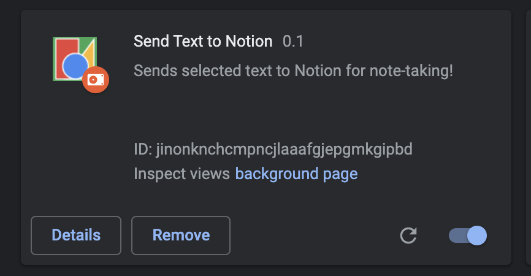

# Send Selected Text to Notion

This is an attempt to build a chrome extension which can send selected text to notion with the context of where it is captured from.

## Sample usage

Once the extension is installed and configured - you can select the text using context menu option

This will appear in the notion note as - 

## Installation

1. Clone the repo
2. Goto [chrome extensions page](chrome://extensions/)
3. select "Load Unpacked"
4. select path of folder "send-to-notion-ext" from this repo

You should see the extension be installed - 

move ahead to configuration section.

## Configuration

After the extension is installed - 

1. Click on Details and select "Extension Options"
2. It'll open a options page - Configure "Notion Token" and "Default page" by following the instruction in the "Note section".
3. Save and you can proceed with using the extension.

